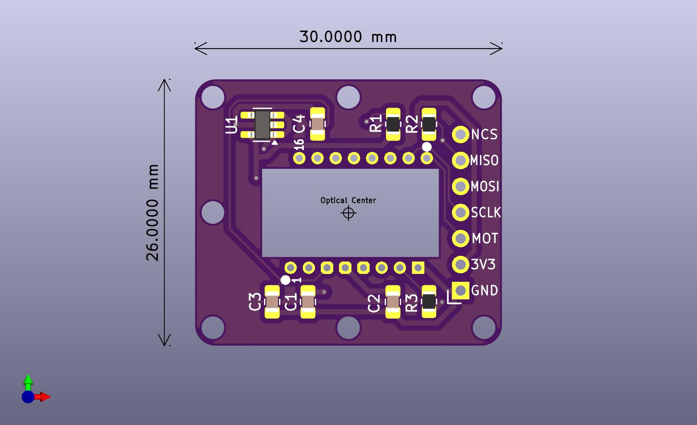

# PMW3360 Breakout Board - SUSUGOROMO-3360（煤衣-3360）

## 寸法図/Dimensions

## 回路図/Schematic
* [PDF](img/schematic.pdf)

## ピン番号
|1  |2   |3   |4   |5     |6  |7  |
|---|----|----|----|------|---|---|
|NCS|MISO|MOSI|SCLK|MOTION|3V3|GND|

## 部品表/BOM

| Reference      | Value               | Footprint | Qty |
| -------------- | ------------------- | --------- | --- |
| C1, C4         | 0.1uF               | 0805      | 2   |
| C2             | 1uF                 | 0805      | 1   |
| C3             | 4.7uF/10V           | 0805      | 1   |
| R2, R3         | 10k                 | 0805      | 2   |
| R1             | 39R                 | 0805      | 1   |
| U1             | TLV70019DDCR        | SOT23-5   | 1   |
| U2             | PMW3360DM-T2QU      |           | 1   |

## Dependencies (KiCad)
* [is-watering/isw-kbd-lib](https://github.com/is-watering/isw-kbd-lib)

## ライセンス/License
This project is licensed under the CERN OHL-P v2.
You may use, distribute, and modify this design under the terms of the CERN OHL-P v2.
Original design by snize.

### 本プロジェクトを利用する場合について
- 著作権表示とライセンスの表示を残してください
